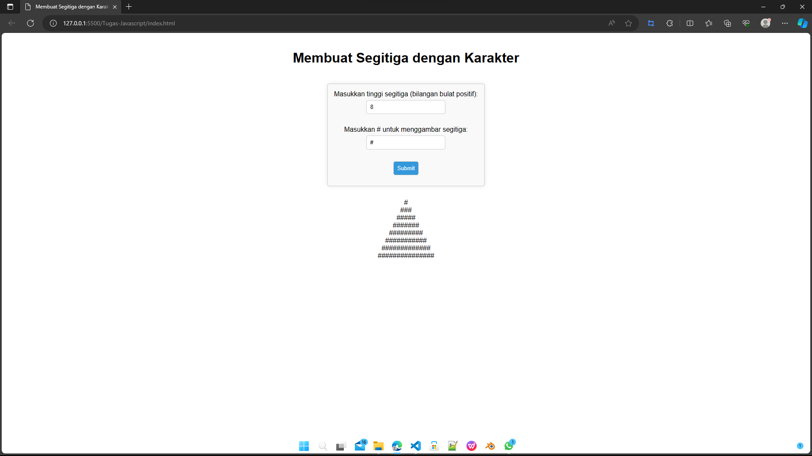

# Membuat Segitiga dengan Karakter

## Deskripsi
Halaman web sederhana yang memungkinkan pengguna menggambar segitiga dengan karakter kustom. Pengguna dapat memasukkan tinggi segitiga (bilangan bulat positif) dan karakter yang akan digunakan untuk menggambar segitiga.

## Tampilan Halaman
- Judul "Membuat Segitiga dengan Karakter" yang berada di tengah halaman.
- Formulir yang meminta pengguna untuk memasukkan tinggi segitiga dan karakter yang akan digunakan.
- Tombol "Submit" untuk menghasilkan segitiga.
- Area hasil yang menampilkan segitiga yang digambar.

## Fungsionalitas JavaScript
Fungsi JavaScript `generateTriangle(event)` digunakan untuk menghasilkan segitiga sesuai dengan input pengguna. Fungsi ini memiliki beberapa fitur:
- Menggunakan `event.preventDefault()` untuk mencegah refresh halaman saat tombol "Submit" ditekan.
- Mengambil nilai tinggi segitiga dan karakter yang dimasukkan oleh pengguna.
- Memvalidasi bahwa tinggi segitiga adalah bilangan bulat positif sebelum menggambar segitiga.
- Menggambar segitiga sesuai dengan karakter yang dipilih oleh pengguna dan menampilkan hasilnya di area hasil.

## Tampilan Hasil
Hasil dari segitiga yang digambar akan ditampilkan di bawah formulir pada halaman. Tampilan segitiga dibuat dengan menggunakan karakter kustom yang dipilih oleh pengguna.

## Cara Menggunakan
1. Buka halaman web ini di browser Anda.
2. Masukkan tinggi segitiga (bilangan bulat positif) yang diinginkan.
3. Masukkan karakter yang akan digunakan untuk menggambar segitiga.
4. Klik tombol "Submit" untuk melihat hasilnya.

## Contoh Penggunaan

