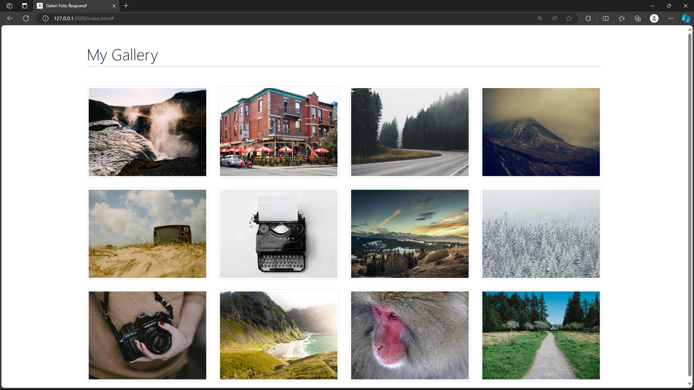
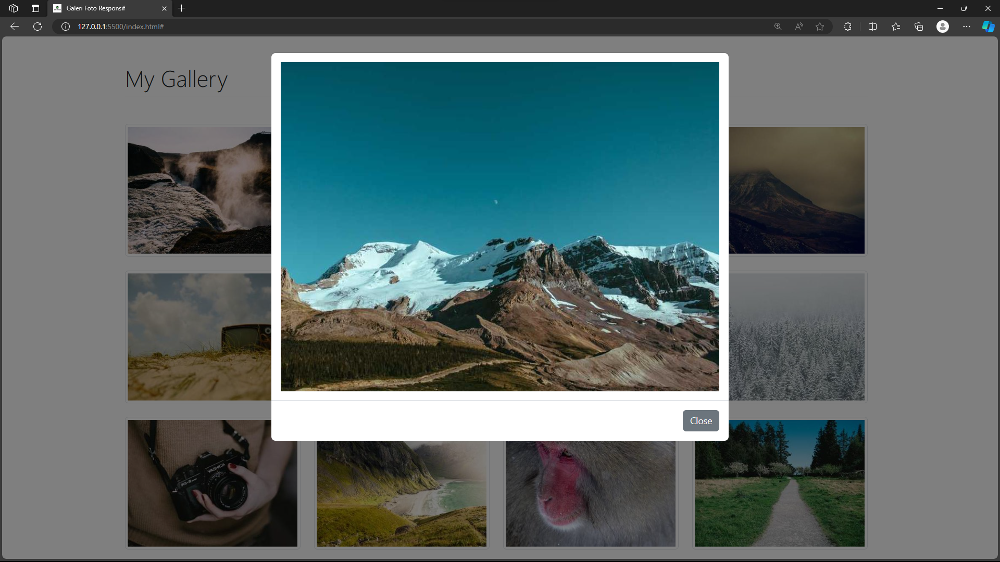

# Halaman Web Galeri Foto Responsif

## Daftar Isi
- [Deskripsi](#deskripsi)
- [Screenshot](#screenshot)
- [Fitur](#fitur)
- [Teknologi yang Digunakan](#teknologi-yang-digunakan)
- [Cara Penggunaan](#cara-penggunaan)

## Deskripsi
Halaman web ini adalah galeri foto responsif yang dibangun menggunakan HTML dan Bootstrap. Halaman ini menampilkan kumpulan gambar dalam tata letak grid, dan setiap gambar dapat diklik untuk membuka modal dengan versi gambar yang lebih besar.

## Screenshot

## Fitur
- Tata letak grid responsif untuk berbagai ukuran layar.
- Modal pop-up untuk setiap gambar untuk tampilan yang lebih besar.
- Integrasi dengan Bootstrap untuk gaya.

## Teknologi yang Digunakan
- HTML
- Bootstrap 5.2.3

## Cara Penggunaan
1. Klona repositori: `git clone https://github.com/AfandiIkhsyan/Prak.Desain-Web/tree/main/pert11`
2. Buka file `index.html` di peramban web Anda.
